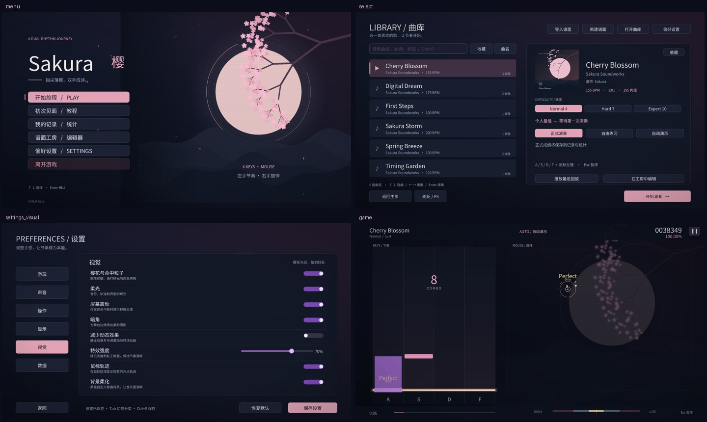

# Sakura · 樱

左手节奏，右手旋律。Sakura 是 Windows 上的双操作区音游：左侧 A / S / D / F 四轨下落，右侧鼠标点击与滑动，以夜樱、月光和花瓣为视觉主题。

当前版本：**0.6.0-beta**。提供完整离线游玩、教程、曲库、练习、回放、本地成绩、设置和谱面工房。



## 开始游玩

解压整个 Windows x64 发行包，运行 `Sakura.exe`。请保留同目录的 DLL、`resources` 和 `config`。支持 Windows 10 1903 及以上、Windows 11；建议使用耳机、实体键盘和鼠标，窗口最低 960 × 540。

首次启动可进入五课教程。随后选择曲目与难度，点击「开始演奏」。默认 A / S / D / F 对应四轨，鼠标左键处理右侧音符，Esc 暂停，R 重试，F11 切换全屏。正式演奏记录成绩；练习、自动演示和回放均明确标记为辅助模式。

- 6 首内置曲目、10 张谱面；主曲包包含 4 首原创程序合成乐曲。
- 六页设置：游玩、声音、操作、显示、视觉、数据；包括节拍校准、自定义键位、帧率限制和减少动态效果。
- 曲库支持搜索、收藏、排序、导入、难度选择、分段变速循环练习和最近回放。
- 谱面工房支持四种音符、撤销/重做、属性修改、自动恢复文件和完整双区试玩。
- 成绩、设置、回放、自制谱面可一起备份与恢复。

完整操作见 [中文玩家指南](doc/PLAYER_GUIDE.md)，本轮修复与验证见 [交付检查记录](doc/RELEASE_REVIEW_0.6.0.md)。

## 本地数据

默认存档位于 `%APPDATA%\Sakura\Sakura\`，设置中的「数据 → 打开数据目录」可直接定位。升级时替换程序目录即可，个人记录保留在用户目录。

需要便携模式时，在 `Sakura.exe` 同目录创建空文件 `portable.txt`，数据改存该目录下的 `userdata`。切换存储模式前，可用游戏内的备份/恢复迁移记录。

## 从源码构建

需要 Visual Studio 2022 的 C++ 桌面开发组件、CMake 3.25+、Git、vcpkg，并设置 `VCPKG_ROOT`。依赖由 manifest 自动安装，版本由仓库 baseline 固定。

```powershell
cmake --preset release -DSAKURA_BUILD_TESTS=ON
cmake --build --preset release --parallel
ctest --test-dir build/release -C Release --output-on-failure
.\build\release\Release\Sakura.exe
```

也可使用 `debug` preset。Windows 的 CMake 构建目录是多配置目录，例如 `cmake --build build/debug --config Release` 同样可生成 Release。Linux 目前提供 `ci-linux` 逻辑层测试，不提供桌面发行版。

```powershell
python scripts/package_release.py --build-dir build/release
```

打包脚本收集程序、依赖 DLL、MSVC x64 运行库、内置内容、文档和许可证，输出 `build/dist` 中的 ZIP、逐文件清单及 SHA256。可用 `--crt-dir` 指定 `Microsoft.VC143.CRT` 目录，用 `--portable` 生成便携版。

技术依赖见 [依赖清单](doc/DEPENDENCIES.md)，内容格式见 [谱面规范](doc/CHART_FORMAT_SPEC.md)，第三方声明见 [THIRD_PARTY_NOTICES.md](THIRD_PARTY_NOTICES.md)。
